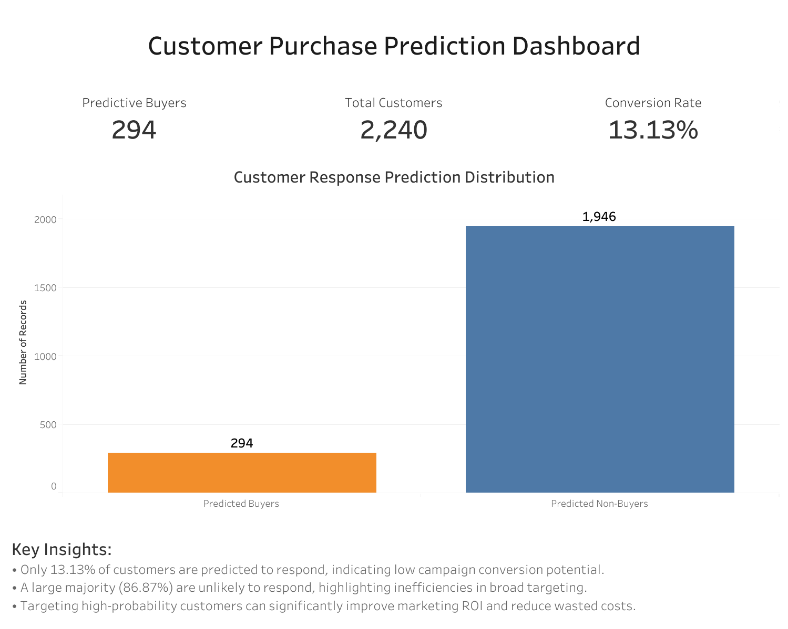

# Customer Purchase Prediction & Marketing Optimization

## Project Overview
This project predicts whether a customer will respond to a marketing campaign using machine learning.

The focus is not only on model accuracy, but on evaluating performance in terms of business impact—specifically the ability to identify potential buyers and improve marketing efficiency.

Three models were implemented and compared:
- Logistic Regression (Baseline)
- Random Forest Classifier (Final Model)
- XGBoost Classifier

---

## Objective
To build a predictive model that identifies customers likely to respond to marketing campaigns, while prioritizing recall and business value over accuracy alone.

---

## Dataset
Source: https://www.kaggle.com/datasets/imakash3011/customer-personality-analysis  
Dataset Used: `marketing_campaign.csv`

Key Characteristics:
- ~2,240 customer records
- Original features: 29+
- Final features used: 7 selected features
- Target variable: `Response`
  - 0 = No (Non-buyer)
  - 1 = Yes (Buyer)

---

## Tools & Technologies
- Python
- Pandas, NumPy
- Scikit-learn
- XGBoost
- Matplotlib, Seaborn
- Jupyter Notebook
- Tableau

---

## Data Preprocessing

Steps Performed:
- Handled missing values using median imputation
- Feature engineering:
  - Age (from Year_Birth)
  - Total Spending
  - Total Purchases
- Removed irrelevant columns:
  - ID, Dt_Customer, Z_CostContact, Z_Revenue
- Applied encoding for categorical variables
- Train-test split (80/20)

---

## Feature Selection (36 → 7 Features)

The feature set was reduced to 7 key predictors to improve model efficiency and reduce noise.

Reasons for reduction:
- Remove redundant and low-impact variables
- Reduce overfitting risk
- Improve interpretability
- Maintain performance with fewer inputs

Key insight:
The model maintained similar performance after feature reduction, indicating that a smaller, well-selected feature set is sufficient.

---

## Model Development

Models Used:
- Logistic Regression
- Random Forest
- XGBoost

Evaluation Metrics:
- Accuracy
- Precision, Recall, F1-score
- Confusion Matrix

---

## Results

| Model               | Accuracy |
|--------------------|---------|
| Logistic Regression | ~0.86   |
| Random Forest       | ~0.87   |
| XGBoost             | ~0.86   |

Random Forest achieved the best overall performance.

---

## Confusion Matrix (Random Forest)

|                | Predicted No | Predicted Yes |
|----------------|-------------|--------------|
| Actual No      | 372         | 9            |
| Actual Yes     | 49          | 18           |

---

## Model Interpretation

- Strong performance in identifying non-buyers
- Weak performance in identifying actual buyers
- High number of false negatives (49)

This means many potential buyers were missed by the model.

---

## Key Insight

Despite achieving ~87% accuracy, the model has low recall for buyers (~27%).

This indicates:
- Class imbalance in the dataset
- Bias toward predicting non-buyers
- Missed revenue opportunities

Accuracy alone is not a reliable metric in this problem.

---

## Tableau Dashboard

This dashboard presents the model’s predictions and translates them into actionable business insights for marketing optimization.

### Key Metrics
- **Total Customers:** 2,240  
- **Predicted Buyers:** 294  
- **Conversion Rate:** 13.13%  

### Interactive Dashboard
[View Tableau Dashboard](https://public.tableau.com/views/CustomerPurchasePredictionDashboard/Dashboard1)

### Dashboard Preview

# Customer Purchase Prediction & Marketing Optimization

## Project Overview
This project predicts whether a customer will respond to a marketing campaign using machine learning.

The goal is not only to achieve high accuracy, but to evaluate model performance in terms of **business impact**—specifically the ability to identify potential buyers and improve marketing efficiency.

Three classification models were developed and compared:
- Logistic Regression (Baseline)
- Random Forest Classifier (Final Model)
- XGBoost Classifier

---

## Objective
To build a predictive model that identifies customers likely to respond to marketing campaigns, while prioritizing **recall and business value over accuracy alone**.

---

## Dataset
Source: https://www.kaggle.com/datasets/imakash3011/customer-personality-analysis  
Dataset Used: `marketing_campaign.csv`

### Key Characteristics:
- ~2,240 customer records
- Original features: 29+
- Final features used: 7 selected features
- Target variable: `Response`
  - 0 = No (Non-buyer)
  - 1 = Yes (Buyer)

---

## Tools & Technologies
- Python
- Pandas, NumPy
- Scikit-learn
- XGBoost
- Matplotlib, Seaborn
- Jupyter Notebook
- Tableau

---

## Data Preprocessing

### Steps Performed:
- Handled missing values using median imputation
- Feature engineering:
  - Age (from Year_Birth)
  - Total Spending
  - Total Purchases
- Removed irrelevant columns:
  - ID, Dt_Customer, Z_CostContact, Z_Revenue
- Applied encoding for categorical variables
- Train-test split (80/20)

---

## Feature Selection (36 → 7 Features)

The feature set was reduced to 7 key predictors to improve model efficiency and reduce noise.

### Reasons for reduction:
- Remove redundant and low-impact variables  
- Reduce overfitting risk  
- Improve interpretability  
- Maintain performance with fewer inputs  

### Key Insight:
The model maintained similar performance after feature reduction, indicating that a smaller, well-selected feature set is sufficient to capture customer behavior patterns.

---

## Model Development

### Models Used:
- Logistic Regression  
- Random Forest  
- XGBoost  

### Evaluation Metrics:
- Accuracy  
- Precision, Recall, F1-score  
- Confusion Matrix  

---

## Results

| Model               | Accuracy |
|--------------------|---------|
| Logistic Regression | ~0.863 |
| Random Forest       | ~0.866 |
| XGBoost             | ~0.866 |

---

## Model Selection Justification

Although Random Forest and XGBoost achieved nearly identical accuracy, **Random Forest was selected for deployment** based on the following considerations:

- Comparable performance to XGBoost (~0.866 accuracy)
- Lower model complexity and easier interpretability
- More stable performance without extensive hyperparameter tuning
- Better suitability for smaller feature space (7 engineered features)

This decision reflects a **practical, business-oriented approach**, prioritizing simplicity and reliability over model complexity when performance gains are marginal.

---

## Confusion Matrix (Random Forest)

|                | Predicted No | Predicted Yes |
|----------------|-------------|--------------|
| Actual No      | 372         | 9            |
| Actual Yes     | 49          | 18           |

---

## Model Interpretation

- Strong performance in identifying non-buyers  
- Weak performance in identifying actual buyers  
- High number of false negatives (49)  

This indicates that many potential buyers are not being captured by the model.

---

## Key Insight

Despite achieving ~87% accuracy, the model has **low recall for buyers (~27%)**.

This indicates:
- Class imbalance in the dataset  
- Bias toward predicting non-buyers  
- Missed revenue opportunities  

**Accuracy alone is not a reliable metric in this context.**

---

## Prediction Behavior Insight

Predicted probabilities tend to fall within a moderate range (approximately 20%–40%).

This reflects:
- The imbalanced nature of the dataset  
- Limited separability between buyers and non-buyers  
- Realistic customer behavior patterns in marketing campaigns  

This behavior indicates that the model is **conservative and avoids overconfident predictions**, which is typical in real-world classification problems with weak signal.

---

## Tableau Dashboard

This dashboard presents the model’s predictions and translates them into actionable business insights.

### Key Metrics
- **Total Customers:** 2,240  
- **Predicted Buyers:** 294  
- **Conversion Rate:** 13.13%  

### Interactive Dashboard
https://public.tableau.com/views/CustomerPurchasePredictionDashboard/Dashboard1

### Dashboard Preview

### Insights
- Majority of customers are predicted as non-buyers (~86.87%)  
- Conversion rate is low, indicating untapped revenue potential  
- The model is effective at identifying non-buyers but misses some potential buyers  
- Targeting high-probability customers can improve marketing ROI  

---

## Business Value

This project demonstrates how machine learning can support marketing decisions:

- Identify high-probability customers  
- Reduce unnecessary marketing costs  
- Improve campaign targeting  
- Increase return on investment (ROI)  

Improving recall can significantly enhance business impact by capturing more potential buyers.

---

## Limitations

- Imbalanced dataset  
- Low recall for buyers  
- Limited feature set  
- Minimal hyperparameter tuning  

---

## Future Improvements

- Apply SMOTE or resampling techniques  
- Perform hyperparameter tuning  
- Optimize for Recall or F1-score  
- Explore advanced models (LightGBM, CatBoost)  
- Expand feature engineering for stronger predictive signal  

---

## Deployment

Predictions were generated using the Random Forest model.

Each customer is assigned:
- Predicted class (Buyer / Non-Buyer)
- Probability score (`Prediction_Prob`)

### Outputs:
- `final_with_predictions.csv`
- `high_value_customers.csv`

These outputs are integrated into Tableau for business visualization.

### Current Status:
- Batch prediction completed  
- Dashboard integration completed  
- Streamlit deployment implemented (prototype stage for real-time prediction)  

---

## Conclusion

Random Forest achieved the best balance between performance and simplicity.

Although overall accuracy is high (~87%), the model struggles to identify potential buyers due to low recall.

This highlights the importance of aligning model evaluation with business objectives rather than relying solely on accuracy.

Improving recall is critical to:
- Capture more potential buyers  
- Increase revenue  
- Optimize marketing strategies  

---

## Author

Allen Adajar  
Cost Accountant | Data Analyst | Aspiring Data Scientist  

GitHub: https://github.com/lenadajar0801-boop
